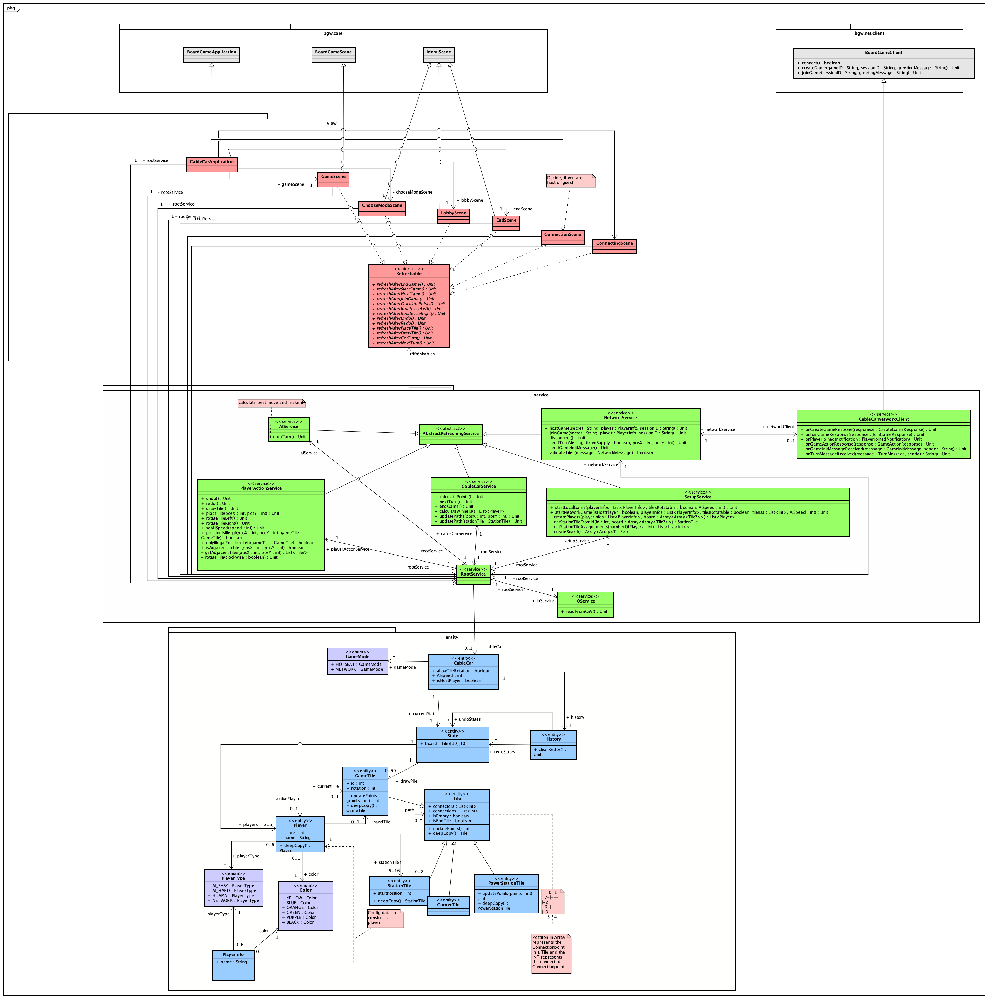

Nachdem ich so paar probleme hatte, wollte ich testen, ob ich pushen kann lol

# SoPra Projekt 2: Cable Car

Im zweiten Projekt des SoPra22d wird das Brettspiel Cable Car als Kotlin-Anwendung unter Verwendung des BoardGameWork realisiert werden. 
Cable Car ist eine Neuauflage des Spiels Metro von 1997. In Cable Car probieren Spieler mittels Gleiskarten möglichst lange Straßenbahnlinien zu bauen.

## Spielregeln

## Anforderungen an das Programm
Das Programm steuert den Spielablauf steuern und sorgt für die Einhaltung der Spielregeln.
Die Folgenden zusätzliche Features, die nicht direkt auf den Spielregeln basieren, werden umgesetzt:

* Die Reihenfolge der 2-6 Spieler soll vor Spielstart frei wählbar oder randomisiert sein.
* Bei der Spielerstellung soll es eine Auswahlmöglichkeit geben, ob Karten entsprechend der vorgegebenen Orientierung gelegt werden müssen oder beliebig drehbar sind.
* Es gibt genau einen Nachziehstapel.
* Das Spiel soll in zwei Modi unabhängig gespielt werden können (Mischung der beiden Modi ist nicht vorgesehen)
* Die Spieler wählen nacheinander und reihum am gleichen Bildschirm ihre Aktionen aus (Hotseat-Modus)
* Die Spieler spielen gegeneinander via Netzwerk unter Verwendung des BGW-Net Moduls
* Es sollen simulierte Mitspieler („KI-Spieler“) zur Verfügung stehen. Hierbei soll es eine einfache Test-KI geben, die z.B. nur randomisiert einen der möglichen Züge auswählt, sowie eine „richtige“ für das am Ende stattfindende KI-Turnier. Es soll auch möglich sein, dass reine KI-Spiele (also ohne menschliche Spieler) durchgeführt werden. Damit ein Zuschauen und Nachvollziehen der Züge möglich wird, soll die Simulationsgeschwindigkeit angepasst werden können.
* Die KIs dürfen beim Spielen keine Vorteile gegenüber einem menschlichen Spieler ausnutzen (z.B. in Nachziehstapel schauen).
* Kein KI-Zug darf länger als 10 Sekunden benötigen.
* Um verschiedene Strategien studieren und ausprobieren zu können, soll das Spiel über eine Undo- und eine Redo-Funktion verfügen. Die Spielzüge sollen bis zum Spielstart zurückgenommen werden können. Für Netzwerkspiele soll dieses Feature deaktiviert sein.

## Design
Die herausgearbeiteten Anforderungen werden wie folgt umgesetzt.

### Klassendiagramm
Die Software-Architektur wird als Klassendiagramms visualisiert. Hierbei existieren Schichten für Entities und Services und darauf eine GUI-Schicht.
Das Design ist Domain-Driven und die GUI wird mit dem Board Game Work Framework umgesetzt, basierend auf JavaFX.
* BGW: https://tudo-aqua.github.io/bgw/bgw-gui-kdoc/index.html
Die Netzwerkkonnektivität läuft über die Server des Lehrstuhls mit dem Netzwerkteil des BGW.
* BGW-NET: https://tudo-aqua.github.io/bgw/bgw-net-client-kdoc/index.html
Die Kommunikation findet über eine sogenannte @TurnMessage statt, die im JSON Format verschickt werden. Definiert ist NTF unter edu.udo.cs.sopra.

### GUI-Konzept
Für das GUI-Konzept wird ein eigens von der Gruppe kreierter Skin für Cable Car genutzt. 
Im Folgenden sind Auszüge aus der geplanten Live-Version zu finden.

#### Game Start

#### Lokales Spiel

#### Netzwerk Spiel

#### Game Board

#### Tiles 

## Wichtige Links

* Aktuelle Informationen zu diesem SoPra: https://sopra.cs.tu-dortmund.de/wiki/sopra/22d/projekt2
* Beispielprojekt Grid-based Sudoku: https://github.com/tudo-aqua/bgw/tree/main/bgw-examples/bgw-sudoku-example/src/main
* Board Game Work: https://tudo-aqua.github.io/bgw/
* Weitere Links: https://sopra.cs.tu-dortmund.de/wiki/infos/links/